# 💰 Minted — Personal Budget & Expense Management

A modern, full-stack personal finance application built with **Angular 21** and **Spring Boot 3**. Track income, expenses, and transfers across multiple accounts with a beautiful dark/light themed UI.

---

## ✨ Features

- **Transaction Management** — Add, edit, and delete income, expenses, and transfers
- **Multi-Account Support** — Track balances across bank accounts, wallets, and credit cards
- **Custom Categories** — Organize transactions with custom categories and icons
- **Dashboard Analytics** — Visualize spending patterns with interactive charts
- **Dark / Light Theme** — System-aware dark mode with customizable accent colors
- **JWT Authentication** — Secure login with token-based auth and auto-refresh
- **AG Grid Data Tables** — Powerful, sortable, filterable transaction grids
- **Responsive Design** — Works on desktop and tablet viewports
- **Docker Ready** — One-command deployment with Docker Compose

---

## 🖥 Screenshots

> See [screenshots/README.md](./screenshots/README.md) for a full annotated gallery with descriptions of every module.

### Dashboard
| Dark Mode | Light Mode |
|-----------|------------|
| 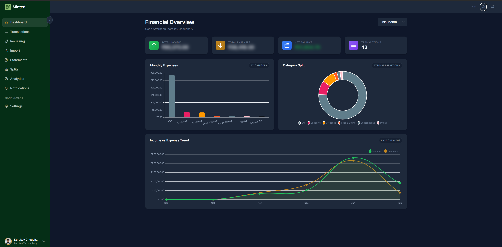 | 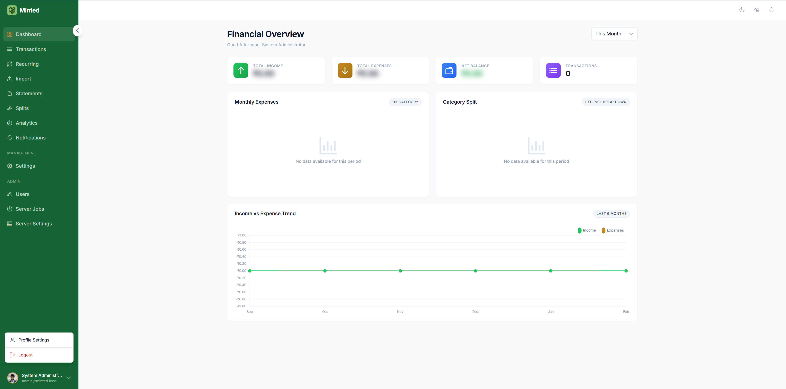 |

### Transactions & Recurring
| Transactions | Recurring |
|-------------|-----------|
|  | 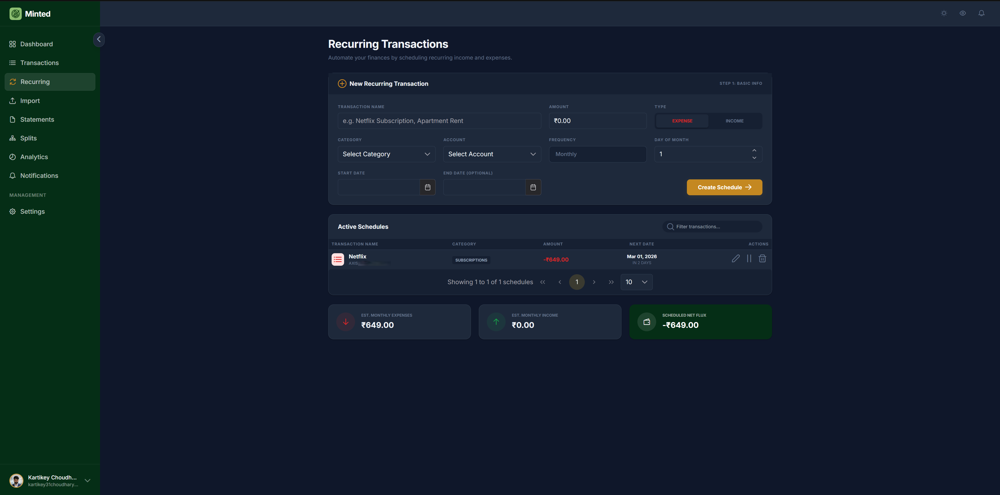 |

### Analytics & Splits
| Analytics | Splits |
|-----------|--------|
| 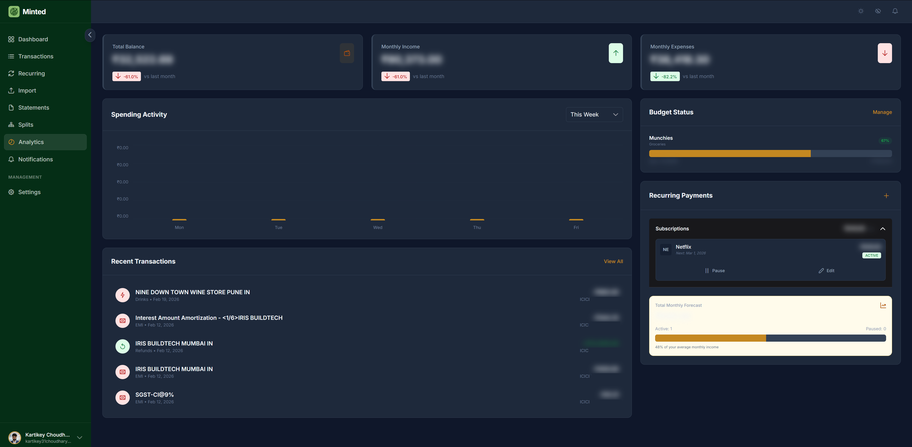 | 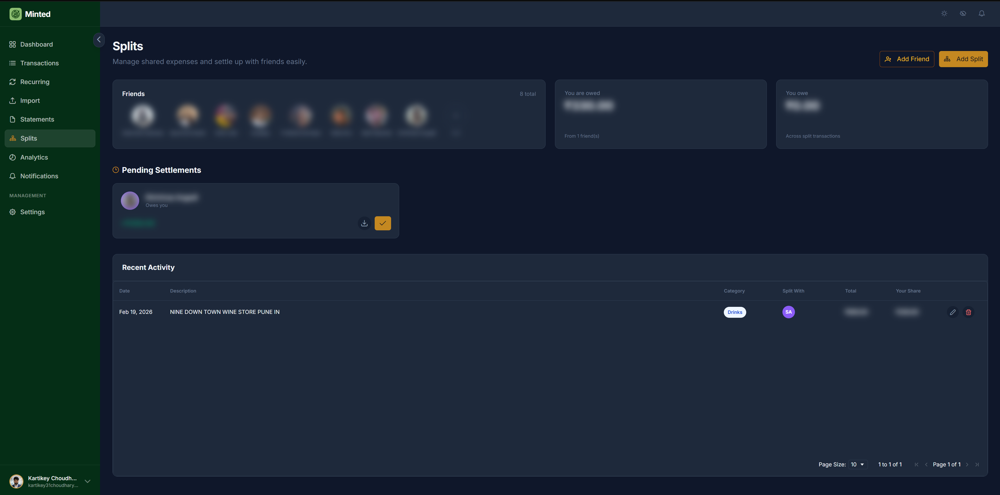 |

### Import & Statements
| Bulk Import | Statements | Upload Statement |
|-------------|-----------|-----------------|
| 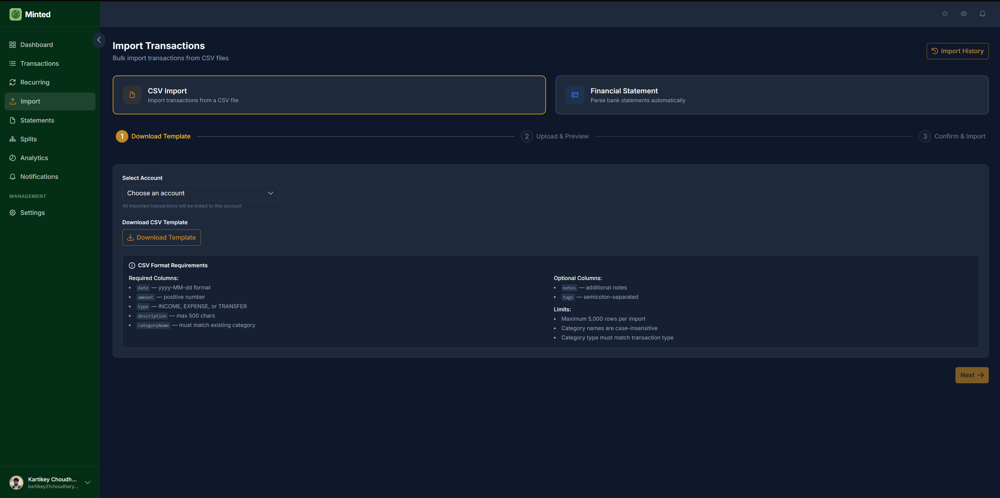 | 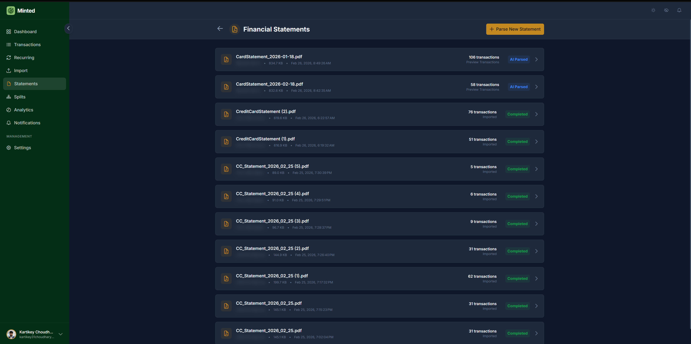 | 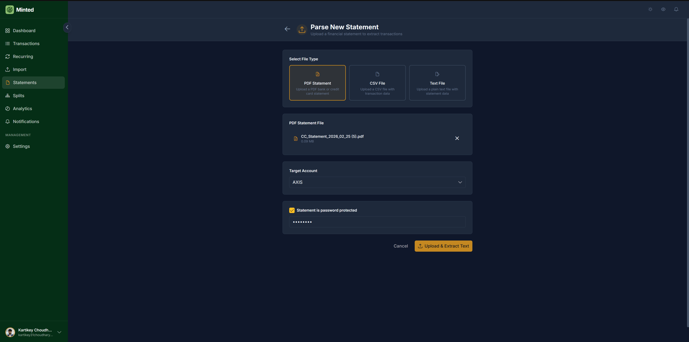 |

### Settings
| Profile | Accounts | Account Types |
|---------|---------|--------------|
| 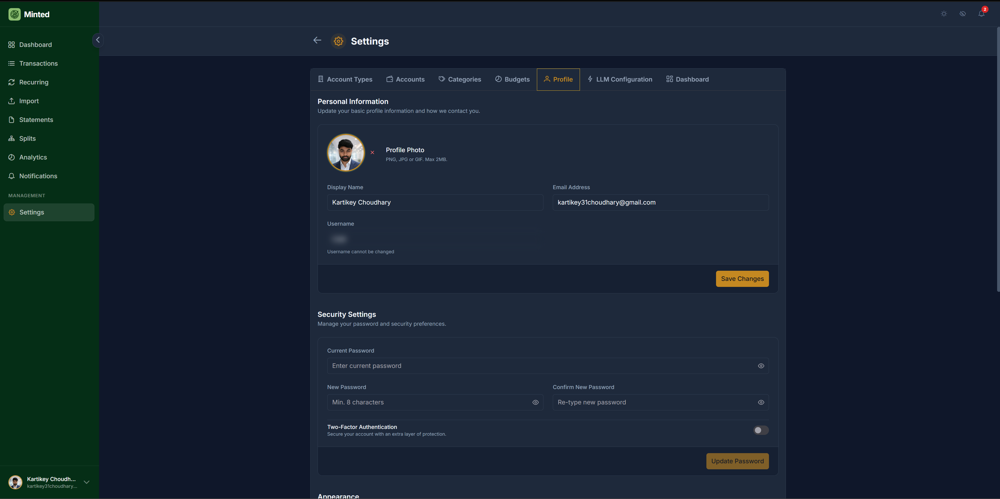 |  | 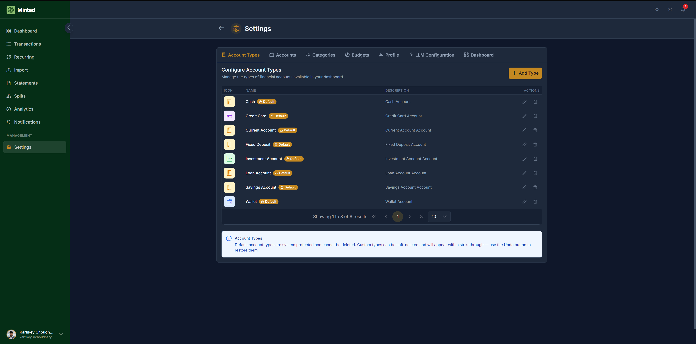 |

| Categories | Budgets | Dashboard Config | LLM |
|-----------|---------|-----------------|-----|
| 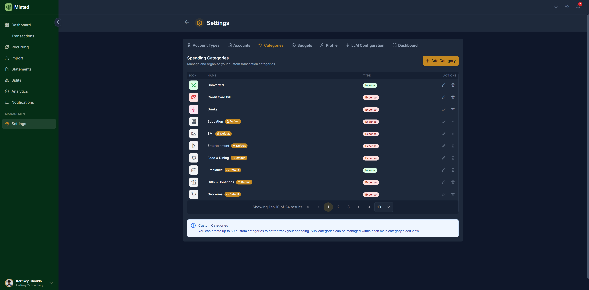 | 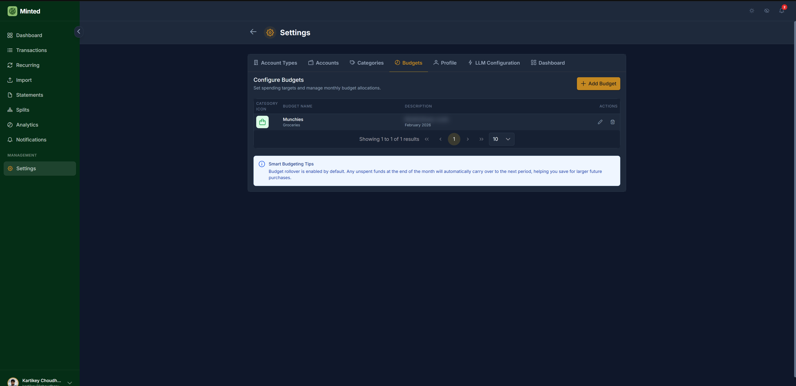 | 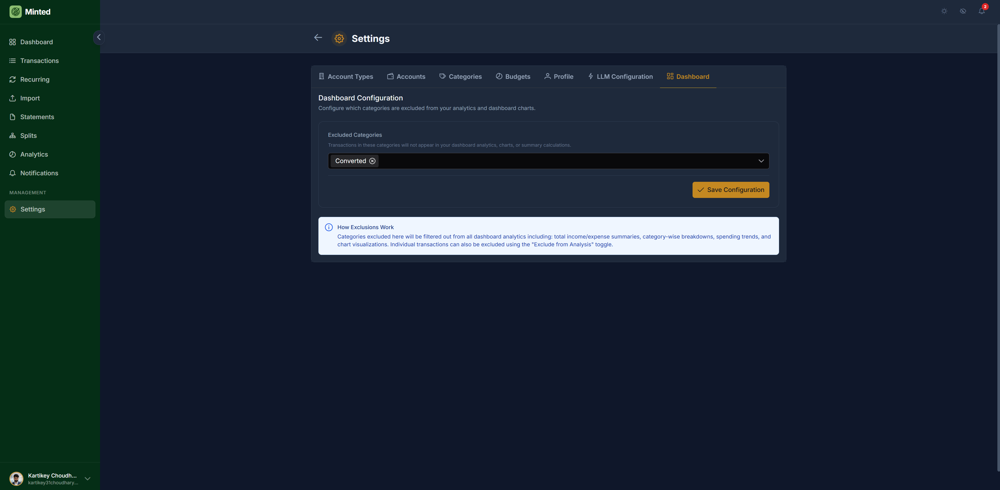 | 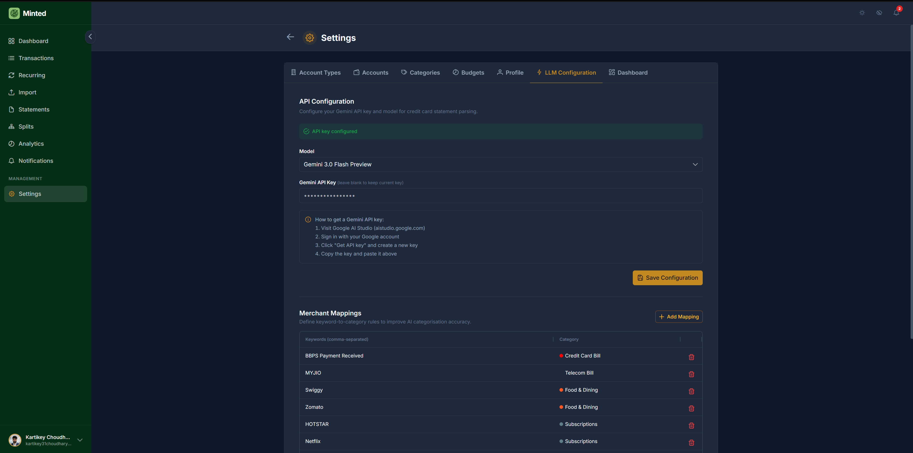 |

### Admin Panel
| User Management | Jobs | Server Settings |
|----------------|------|----------------|
| 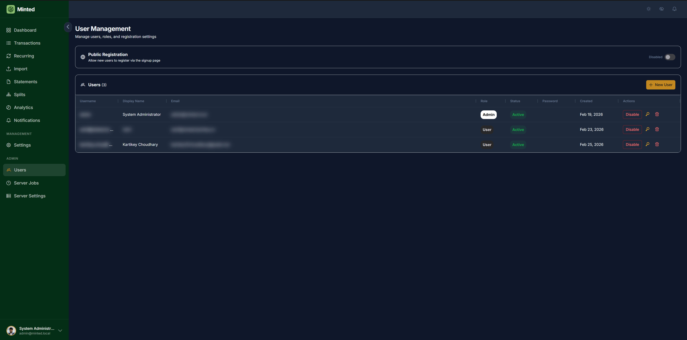 | 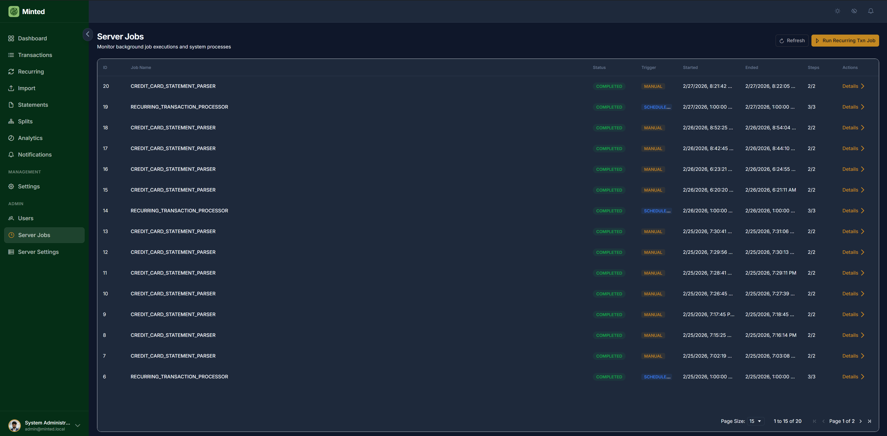 | 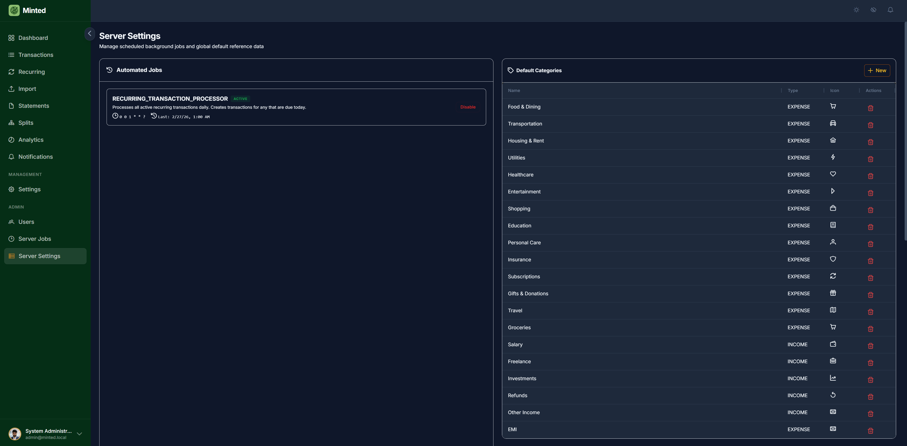 |

---

## 🏗 Tech Stack

| Layer       | Technology                                         |
| ----------- | -------------------------------------------------- |
| **Frontend** | Angular 21, PrimeNG, AG Grid, Tailwind CSS, Chart.js |
| **Backend**  | Java 17, Spring Boot 3.2, Spring Security, Flyway   |
| **Database** | MySQL 8.0                                           |
| **Auth**     | JWT (jjwt), Jasypt encryption                       |
| **DevOps**   | Docker, Docker Compose, Nginx                       |

---

## 📁 Project Structure

```
minted/
├── minted-api/              # Spring Boot backend
├── minted-web/              # Angular frontend
├── docs/                    # Specs, history, and design references
├── screenshots/             # Annotated app screenshots
├── docker-compose.yml       # Build-from-source Docker orchestration
├── docker-compose.prod.yml  # Production: uses pre-built Docker Hub images
├── Dockerfile               # Frontend multi-stage build (Node → Nginx)
└── nginx.conf               # Nginx reverse proxy config
```

---

## 🚀 Getting Started

### Prerequisites

| Tool           | Version | Notes                          |
| -------------- | ------- | ------------------------------ |
| Node.js        | 20+     | For frontend                   |
| Java           | 17      | For backend                    |
| MySQL          | 8.x     | Or use Docker                  |
| Angular CLI    | 21      | `npm i -g @angular/cli`        |
| Docker         | 24+     | _Optional — for Docker setup_  |

---

### Option A: Run Locally

#### 1. Clone the repository

```bash
git clone https://github.com/kartikeychoudhary/minted.git
cd minted
```

#### 2. Start MySQL

Make sure MySQL 8 is running locally. Create the database:

```sql
CREATE DATABASE minted_db;
```

#### 3. Start the Backend

```bash
cd minted-api

# Set environment variables
export MINTED_DB_HOST=localhost
export MINTED_DB_PORT=3306
export MINTED_DB_NAME=minted_db
export MINTED_DB_USER=root
export MINTED_DB_PASSWORD=your_password
export MINTED_JWT_SECRET=your-256-bit-secret-key-here
export MINTED_JASYPT_PASSWORD=your-jasypt-password
export MINTED_ENCRYPTION_KEY=your-encryption-key-here

# Run database migrations
./gradlew flywayMigrate

# Start the server (port 5500)
./gradlew bootRun
```

> **Windows PowerShell:** Use `$env:MINTED_DB_HOST = "localhost"` instead of `export`.

Swagger UI: [http://localhost:5500/swagger-ui](http://localhost:5500/swagger-ui)

#### 4. Start the Frontend

```bash
cd minted-web

# Install dependencies
npm install

# Start dev server (port 4200)
npm start
```

App: [http://localhost:4200](http://localhost:4200)

#### 5. Default Credentials

| Username | Password |
| -------- | -------- |
| `admin`  | `admin`  |

---

### Option B: Run with Docker Hub Images (Recommended for Production)

Pull and run the pre-built images from Docker Hub — **no source code or build tools required**.

#### 1. Download the compose file and create `.env`

```bash
# Download files
curl -O https://raw.githubusercontent.com/kartikeychoudhary/minted/main/docker-compose.prod.yml
curl -O https://raw.githubusercontent.com/kartikeychoudhary/minted/main/.env.example

# Create your .env
cp .env.example .env
# Edit .env and set MINTED_JWT_SECRET, MINTED_JASYPT_PASSWORD, etc.
```

#### 2. Start all services

```bash
# Pull latest images and start
docker compose -f docker-compose.prod.yml up -d

# Or pin to a specific release
MINTED_VERSION=v1.0.0 docker compose -f docker-compose.prod.yml up -d
```

#### 3. Access the app

| Service    | URL                                                                     |
| ---------- | ----------------------------------------------------------------------- |
| Frontend   | [http://localhost](http://localhost)                                      |
| Backend    | [http://localhost:5500](http://localhost:5500)                           |
| Swagger UI | [http://localhost:5500/swagger-ui](http://localhost:5500/swagger-ui)     |

#### 4. Stop the stack

```bash
docker compose -f docker-compose.prod.yml down        # preserves data
docker compose -f docker-compose.prod.yml down -v     # wipes database
```

---

### Option C: Build from Source with Docker

The entire stack (MySQL + Backend + Frontend) can be built locally and launched with a single command.

#### 1. Create a `.env` file in the project root

```env
# Required
MINTED_JWT_SECRET=your-256-bit-secret-key-here

# Optional (shown with defaults)
MINTED_DB_ROOT_PASSWORD=rootroot
MINTED_DB_NAME=minted_db
MINTED_DB_USER=minted_user
MINTED_DB_PASSWORD=minted_pass
MINTED_JASYPT_PASSWORD=default-jasypt-password
MINTED_ENCRYPTION_KEY=your-encryption-key-here
BACKEND_PORT=5500
FRONTEND_PORT=80
```

#### 2. Build and start all services

```bash
docker compose up --build -d
```

This will:
- Start **MySQL 8** with a health check
- Build and start the **Spring Boot API** (waits for MySQL)
- Build and start the **Angular app** served via **Nginx** (waits for API)

#### 3. Access the app

| Service    | URL                                            |
| ---------- | ---------------------------------------------- |
| Frontend   | [http://localhost](http://localhost)             |
| Backend    | [http://localhost:5500](http://localhost:5500)   |
| Swagger UI | [http://localhost:5500/swagger-ui](http://localhost:5500/swagger-ui) |

#### 4. Stop the stack

```bash
# Stop containers (data is preserved)
docker compose down

# Stop AND delete database volume
docker compose down -v
```

#### Troubleshooting

**Permission denied on `./gradlew` (Linux/macOS)**
If you are running Docker on a Linux/macOS machine after cloning or copying the project from Windows, you might encounter a `Permission denied` error for the Gradle wrapper during the backend build. To fix this, grant execute permissions to the wrapper file:

```bash
chmod +x minted-api/gradlew
docker compose up --build -d
```

---

## 📖 Documentation

| Document | Description |
| -------- | ----------- |
| [DOCKER_README.md](./DOCKER_README.md) | Full Docker deployment guide (build & prod Hub images) |
| [screenshots/README.md](./screenshots/README.md) | Annotated screenshot gallery for all modules |
| [minted-web/README.md](./minted-web/README.md) | Frontend setup, architecture, theming |
| [minted-api/README.md](./minted-api/README.md) | Backend setup, API structure, migrations |
| [docs/API_SPEC.md](./docs/API_SPEC.md) | REST API specification |
| [docs/BACKEND_SPEC.md](./docs/BACKEND_SPEC.md) | Backend architecture spec |
| [docs/FRONTEND_SPEC.md](./docs/FRONTEND_SPEC.md) | Frontend architecture spec |
| [docs/PROJECT_HISTORY.md](./docs/PROJECT_HISTORY.md) | Consolidated phase completion log |

---

## 🔒 Security

Minted includes several hardened security measures:

- **Default-deny authorization** — All unmatched routes return 403. Only explicitly listed paths are accessible.
- **AES-256-GCM encryption for API keys** — LLM API keys stored in the database are encrypted at rest using AES-256-GCM with random IVs via a JPA `AttributeConverter`.
- **Jasypt AES-256 encryption** — Property-level encryption uses `PBEWITHHMACSHA512ANDAES_256` with random IVs (upgraded from legacy DES/MD5).
- **Restricted CORS headers** — Only `Content-Type`, `Authorization`, `X-Requested-With`, and `Accept` headers are allowed.
- **No stack trace leakage** — Generic 500 errors return a safe message; details are logged server-side only.
- **Force password change** — The default admin user must change their password on first login.

### Environment Variables for Security

| Variable | Purpose | Required |
|---|---|---|
| `MINTED_JWT_SECRET` | JWT signing key (min 256 bits) | Yes |
| `MINTED_JASYPT_PASSWORD` | Jasypt property encryption password | Yes (for production) |
| `MINTED_ENCRYPTION_KEY` | AES-256 key for DB-stored API keys (falls back to `MINTED_JASYPT_PASSWORD`) | Recommended |

Generate secure values:
```bash
openssl rand -base64 64   # for JWT_SECRET
openssl rand -base64 32   # for JASYPT_PASSWORD
openssl rand -base64 32   # for ENCRYPTION_KEY
```

---

## 🎨 Theming

Minted uses a **CSS custom property** design system (`--minted-*` tokens) with:

- **Light mode** — Clean white surfaces with subtle borders
- **Dark mode** — Elevated slate palette (not pure black)
- **Accent colors** — 6 switchable presets (Amber, Emerald, Blue, Violet, Rose, Teal)
- **AG Grid v35 Theming API** — Data grid inherits all theme tokens automatically

---

## 📄 License

Proprietary — Kartikey Choudhary © 2026
