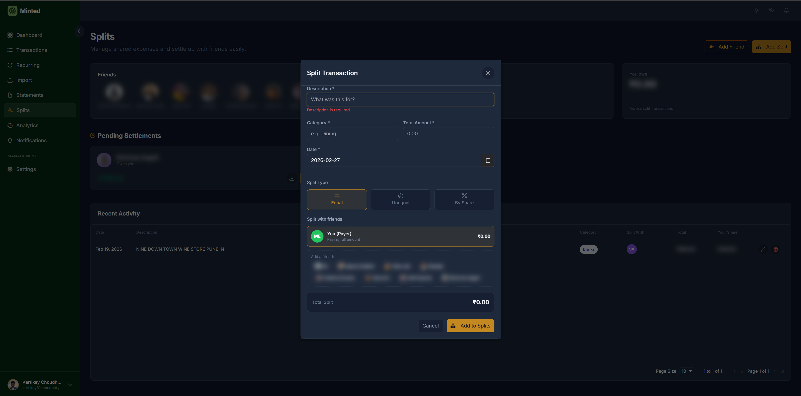
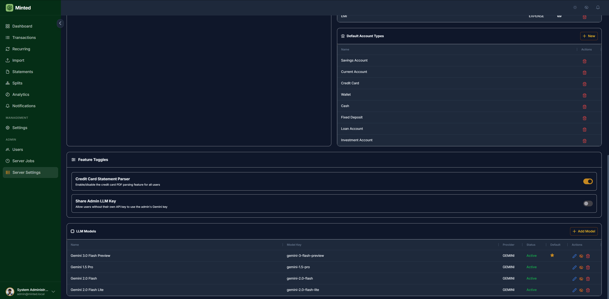

# 📸 Minted — Screenshots Gallery

This document provides an annotated walkthrough of every screen and module in **Minted**, a full-stack personal budget and expense management application.

---

## 📋 Table of Contents

1. [Dashboard](#-dashboard)
2. [Transactions](#-transactions)
3. [Recurring Transactions](#-recurring-transactions)
4. [Analytics](#-analytics)
5. [Splits](#-splits)
6. [Import (Bulk CSV)](#-import-bulk-csv)
7. [Statements](#-statements)
8. [Settings](#-settings)
9. [Admin Panel](#-admin-panel)
10. [Layout](#-layout)

---

## 📊 Dashboard

The Dashboard is the home screen of Minted. It provides an at-a-glance summary of your financial health with interactive charts and summary cards.

**Features shown:**
- Income vs. Expense summary cards with totals for the selected period
- Net balance and account balance overview
- Spending trend bar chart (by day/week/month)
- Category breakdown donut/pie chart
- Top merchants list
- Date range selector for all widgets

### Dark Mode

### Light Mode

> Minted supports **6 accent color presets** (Amber, Emerald, Blue, Violet, Rose, Teal) plus a full dark/light theme toggle accessible from the sidebar.

---

## 💳 Transactions

The Transactions page is the core ledger of Minted. All your income, expenses, and transfers are listed here in a powerful AG Grid data table.

**Features shown:**
- AG Grid with sortable and filterable columns (date, description, category, account, amount, type)
- Transaction type badges: **Income** (green), **Expense** (red), **Transfer** (blue)
- Inline **Create / Edit / Delete** dialogs
- Split indicator — transactions linked to a bill split show a split badge
- Date range filter, category filter, account filter, and transaction type filter
- Bulk actions and CSV export

---

## 🔁 Recurring Transactions

The Recurring Transactions page lets you define repeating income or expense rules that the system automatically creates on schedule.

**Features shown:**
- AG Grid listing all recurring rules (name, amount, category, account, frequency, next due date)
- Frequency options: Daily, Weekly, Monthly, Yearly
- Create / Edit / Delete dialogs
- Active / Paused status toggle per rule
- Integration with the job scheduler — cron jobs execute recurring transaction creation automatically

---

## 📈 Analytics

The Analytics page provides deeper reporting and visualization beyond the Dashboard. Designed for understanding spending patterns over time.

**Features shown:**
- **Spending Activity** chart — bar/line chart showing spend over a selected period
- **Category Breakdown** — horizontal bar chart with spend totals per category
- **Income vs Expense** comparison chart
- **Top Merchants** ranked list
- **Monthly Summary** table with income, expense, and net columns
- Configurable date range and grouping (by day, week, month)

---

## 🤝 Splits

The Splits page handles bill splitting with friends. Track who owes what and settle up directly from the app.

**Features shown:**
- Friends list with balances (green = they owe you, red = you owe them)
- Active splits AG Grid: split description, amount, your share, friend, status
- Three split types: **Equal** (50/50), **Unequal** (custom amounts), **Share** (percentage-based)
- Settle balance action — triggers a settlement transaction and sends a notification
- CSV export of all splits per friend

### Add Split Transaction Dialog

> Splits can also be created inline from the **Transactions** page by clicking the split icon on any transaction row.

---

## 📥 Import (Bulk CSV)

The Bulk Import module lets you bulk-upload transactions via CSV — ideal for importing historical data or exporting from your bank.

**Features shown:**
- **Step-by-step wizard**: Upload → Column mapping → Preview → Process
- Column mapping UI: map CSV columns (date, description, amount, etc.) to Minted fields
- Live preview of parsed transactions before committing
- Import job tracking — each import run is logged with status and row counts
- Import history grid showing past imports

---

## 🧾 Statements

The Statements page supports parsing credit card statements (PDF or structured text) and importing transactions automatically using LLM-powered extraction.

**Features shown:**
- Statement upload dropzone (PDF / text file)
- LLM-parsed transaction preview before import
- Source account selector
- Support for multiple statement formats via LLM merchant mapping configuration

### Upload Statement Dialog

---

## ⚙️ Settings

The Settings module contains multiple tabs for configuring all the building blocks of Minted.

---

### Profile
Manage your personal profile, change your password, upload an avatar (with built-in crop tool), and configure display preferences.

**Features shown:**
- Avatar upload with 1:1 crop (512 px JPEG, stored as base64)
- Display name and email
- Password change form
- Theme selector (accent color + dark/light toggle)
- Currency preference

---

### Account Types
Define and manage custom **account types** (e.g., Bank, Credit Card, Wallet, Investment).

**Features shown:**
- AG Grid of account types with name and icon
- Create / Edit / Delete dialogs
- Default types seeded on first run

---

### Accounts
Manage individual **accounts** tied to account types (e.g., HDFC Savings, ICICI Credit Card).

**Features shown:**
- AG Grid of accounts with name, type, starting balance, and current balance
- Create / Edit / Delete dialogs
- Accounts are referenced in every transaction

---

### Categories
Manage **transaction categories** with custom names and icons (e.g., Food, Rent, Salary).

**Features shown:**
- AG Grid of categories with name, icon, and type (Income / Expense / Both)
- Font Awesome icon picker
- Default categories seeded on first run

---

### Budgets
Set monthly **budgets** per category and track how much you've spent against each limit.

**Features shown:**
- AG Grid of budgets with category, period, limit amount, and spent amount
- Budget status indicators (on track / warning / over budget)
- Create / Edit / Delete dialogs

---

### Dashboard Configuration
Customize which **cards and charts** appear on your Dashboard and in what order.

**Features shown:**
- Toggle visibility of each dashboard widget
- Reorder cards via configuration

---

### LLM Configuration
Configure the **Large Language Model** integration used for credit card statement parsing and merchant name normalization.

**Features shown:**
- API key management (AES-256-GCM encrypted at rest)
- Model selector
- Merchant mapping rules (raw merchant string → normalized category)

---

## 🛡 Admin Panel

The Admin Panel is only accessible to users with the **ADMIN** role.

---

### User Management
View and manage all registered users in the system.

**Features shown:**
- AG Grid of users with username, email, role, and status
- Create new users (admin-only signup)
- Edit user details and reset passwords
- Enable / Disable accounts
- Signup toggle — enable/disable public registration

---

### Jobs
Monitor and manage **scheduled background jobs** (Spring Scheduler).

**Features shown:**
- List of all registered cron jobs with name, schedule (cron expression), last run, next run, and status
- Manual trigger button for each job
- Job execution history with run duration and outcome

---

### Server Settings (1)
Configure global server-level settings.

**Features shown:**
- Feature flags (e.g., enable/disable signup, enable/disable LLM features)
- Default account types and categories seeding controls

### Server Settings (2)
Additional server configuration options.

---

## 🗂 Layout

### Sidebar (Closed)
The sidebar collapses to icon-only mode to maximize screen space. The active route is highlighted with the accent color.

**Sidebar navigation items:**
- Dashboard
- Transactions
- Recurring
- Analytics
- Splits
- Import
- Notifications
- Settings
- Admin _(admin role only)_

---

## 🔗 Back to Main README

[← Back to README.md](../README.md)
